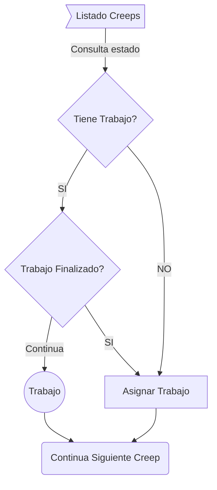

## Circuitos y Flujos

```mermaid
graph TD
B>Listado Creeps]
C{Tiene Trabajo?}
E{Trabajo Finalizado?}
D((Trabajo))
H[Asignar Trabajo]
F(Continua Siguiente Creep)
B -- Consulta estado --> C
C -- SI --> E
E -- SI --> H
C -- NO --> H
E -- Continua --> D
D --> F
H --> F
```